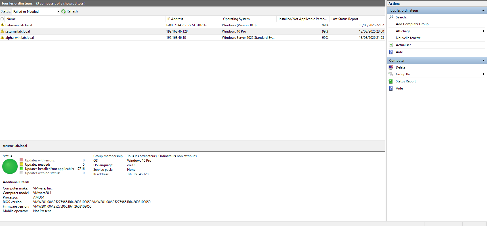
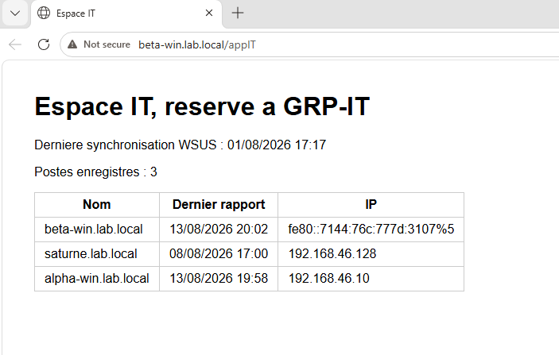

<div align="center">

# Lab Active Directory hybride Windows / Linux

Documentation des commandes utilisées pour construire un lab d'infrastructure : contrôleur de domaine AD, jonction Linux, WSUS, IIS, monitoring Prometheus/Grafana, sauvegarde et durcissement.


</div>

**Environnement** : VMware Workstation, réseau NAT `VMnet9` (192.168.46.0/24), domaine `lab.local`

| Machine | Rôle | OS |
|---|---|---|
| Alpha-win | Contrôleur de domaine | Windows Server 2022 Standard |
| Beta-win | Serveur membre (WSUS, IIS) | Windows Server 2022 Standard Core |
| Rocky01 | Client Linux joint au domaine | Rocky Linux 9 |
| Saturne | Poste de travail | Windows 11 Pro |


---

## Sommaire

**[Phase 1 — Fondations](#phase-1--fondations)**

0. [Réseau VMware, VM et promotion en contrôleur de domaine](#0-réseau-vmware-vm-et-promotion-en-contrôleur-de-domaine)

**[Phase 2 — Administration Active Directory et environnement hybride](#phase-2--administration-active-directory-et-environnement-hybride)**
1. [Active Directory : OU, utilisateurs, groupes](#1-active-directory--ou-utilisateurs-groupes)
2. [Jonction de Rocky Linux au domaine](#2-jonction-de-rocky-linux-au-domaine)
3. [Sudo restreint par groupe sur Rocky](#3-sudo-restreint-par-groupe-sur-rocky)
4. [Montage réseau CIFS/Kerberos multiuser](#4-montage-réseau-cifskerberos-multiuser)

**[Phase 3 — Services : WSUS et IIS](#phase-3--services--wsus-et-iis)**

5. [Serveur membre Beta-win et WSUS](#5-serveur-membre-beta-win-et-wsus)
6. [Diagnostic WSUS et Windows Update](#6-diagnostic-wsus-et-windows-update)
7. [IIS, reverse proxy et applications isolées](#7-iis-reverse-proxy-et-applications-isolées)

**[Phase 4 — Monitoring](#phase-4--monitoring)**

8. [Monitoring : windows_exporter, NAT, Prometheus](#8-monitoring--windows_exporter-nat-prometheus)

**[Phase 5 — Sécurité et sauvegarde](#phase-5--sécurité-et-sauvegarde)**

9. [Sauvegarde et restauration DSRM](#9-sauvegarde-et-restauration-dsrm)
10. [Durcissement : SMB1, pare-feu, comptes de service](#10-durcissement--smb1-pare-feu-comptes-de-service)
11. [Vérification de bout en bout](#11-vérification-de-bout-en-bout)

---

---

## Phase 1 — Fondations

## 0. Réseau VMware, VM et promotion en contrôleur de domaine

### Réseau NAT dédié (VMware Workstation, interface graphique)

`Edit > Virtual Network Editor > Add Network` : création de `VMnet9` en mode **NAT**, isolé du réseau domestique tout en gardant un accès Internet sortant (indispensable plus tard pour WSUS et les téléchargements). Chaque VM du lab est ensuite rattachée à ce réseau plutôt qu'au NAT générique par défaut (`VMnet8`).

### Création des VM

Quatre VM créées avec `Custom (advanced)` plutôt que `Typical`, en sélectionnant **I will install the operating system later** : pour Windows Server, ça évite le mécanisme *Easy Install* de VMware, connu pour générer une erreur "contrat de licence introuvable" avec les ISO d'évaluation Microsoft.

| VM | ISO |
|---|---|
| Alpha-win | Windows Server 2022 (Standard, avec expérience bureau) |
| Beta-win | Windows Server 2022 (Standard Core) |
| Saturne | Windows 11 Pro |
| Rocky01 | Rocky Linux 9 (Minimal) |

### Configuration IP statique sur Alpha-win

```powershell
Set-NetIPInterface -InterfaceAlias "Ethernet0" -Dhcp Disabled
New-NetIPAddress -InterfaceAlias "Ethernet0" -IPAddress 192.168.46.10 -PrefixLength 24 -DefaultGateway 192.168.46.2
Set-DnsClientServerAddress -InterfaceAlias "Ethernet0" -ServerAddresses 127.0.0.1
```

Le DNS pointe sur `127.0.0.1` : une fois AD DS installé, le serveur héberge lui-même le DNS du domaine.

### Renommage

```powershell
Rename-Computer -NewName "Alpha-win" -Restart
```

### Installation du rôle AD DS et promotion en contrôleur de domaine

```powershell
Install-WindowsFeature AD-Domain-Services -IncludeManagementTools
```

```powershell
Install-ADDSForest `
  -DomainName "lab.local" `
  -DomainNetbiosName "LAB" `
  -InstallDNS `
  -SafeModeAdministratorPassword (ConvertTo-SecureString "<mot_de_passe_DSRM>" -AsPlainText -Force)
```

> `-SafeModeAdministratorPassword` définit le mot de passe du compte **DSRM** (Directory Services Restore Mode), différent du compte administrateur de domaine, et indispensable pour toute restauration ultérieure de l'état système (voir [section 9](#9-sauvegarde-et-restauration-dsrm)). À stocker soigneusement, sa perte complique fortement une restauration en situation de crise.

Le serveur redémarre automatiquement à la fin et devient officiellement le contrôleur de domaine.

### Vérification

```powershell
Get-ADDomain
dcdiag
```

---

## Phase 2 — Administration Active Directory et environnement hybride

## 1. Active Directory : OU, utilisateurs, groupes

*Exécuté sur Alpha-win (contrôleur de domaine), PowerShell.*

### Unités d'organisation

```powershell
New-ADOrganizationalUnit -Name "IT" -Path "DC=lab,DC=local"
New-ADOrganizationalUnit -Name "Comptabilite" -Path "DC=lab,DC=local"
New-ADOrganizationalUnit -Name "Direction" -Path "DC=lab,DC=local"
```

### Utilisateurs

```powershell
$motDePasse = ConvertTo-SecureString "P@ssw0rd2026!" -AsPlainText -Force

New-ADUser -Name "Jean Dupont" `
  -GivenName "Jean" -Surname "Dupont" `
  -SamAccountName "j.dupont" `
  -UserPrincipalName "j.dupont@lab.local" `
  -Path "OU=IT,DC=lab,DC=local" `
  -AccountPassword $motDePasse `
  -Enabled $true `
  -ChangePasswordAtLogon $false

New-ADUser -Name "Marie Martin" `
  -GivenName "Marie" -Surname "Martin" `
  -SamAccountName "m.martin" `
  -UserPrincipalName "m.martin@lab.local" `
  -Path "OU=Comptabilite,DC=lab,DC=local" `
  -AccountPassword $motDePasse `
  -Enabled $true `
  -ChangePasswordAtLogon $false
```

### Groupes de sécurité

```powershell
New-ADGroup -Name "GRP-IT" -GroupScope Global -GroupCategory Security -Path "OU=IT,DC=lab,DC=local"
New-ADGroup -Name "GRP-Comptabilite" -GroupScope Global -GroupCategory Security -Path "OU=Comptabilite,DC=lab,DC=local"
```

### Vérifications

```powershell
# Utilisateurs d'une OU
Get-ADUser -Filter * -SearchBase "OU=IT,DC=lab,DC=local" | Select-Object Name, SamAccountName

# Membres d'un groupe
Get-ADGroupMember -Identity "GRP-IT"

# Vue d'ensemble de la structure
Get-ADOrganizationalUnit -Filter * | Select-Object Name, DistinguishedName
```

---

## 2. Jonction de Rocky Linux au domaine

*Exécuté sur Rocky01, bash.*

### Configuration réseau

```bash
# Lister les connexions réseau connues
sudo nmcli con show

# Définir le DNS (pointer vers le contrôleur de domaine)
sudo nmcli con mod "<NOM_CONNEXION>" ipv4.dns "<IP_DNS>"

# Passer en IP statique
sudo nmcli con mod "<NOM_CONNEXION>" ipv4.method manual ipv4.addresses "<IP>/<MASQUE>" ipv4.gateway "<IP_PASSERELLE>"

# Appliquer les changements
sudo nmcli con up "<NOM_CONNEXION>"

# Vérifier
cat /etc/resolv.conf
```

### Synchronisation de l'heure

Kerberos refuse toute authentification si l'horloge dévie de plus de 5 minutes entre le client et le contrôleur de domaine.

```bash
sudo dnf install chrony -y
sudo systemctl enable --now chronyd
timedatectl
systemctl status chronyd
```

### Installation des paquets de jonction

```bash
sudo dnf install realmd sssd oddjob oddjob-mkhomedir adcli samba-common-tools -y
```

| Paquet | Rôle |
|---|---|
| `realmd` | Orchestre la jonction, fournit la commande `realm` |
| `sssd` | Gère l'authentification et le cache des identités au quotidien |
| `oddjob` / `oddjob-mkhomedir` | Création automatique du répertoire home au premier login |
| `adcli` | Dialogue technique bas niveau avec Active Directory |
| `samba-common-tools` | Utilitaires partagés nécessaires à adcli/sssd |

### Jonction

```bash
# Découvrir le domaine
sudo realm discover lab.local

# Le nom d'hôte doit être complet avant de joindre
sudo hostnamectl set-hostname rocky01.lab.local
hostnamectl

# Rejoindre le domaine
sudo realm join lab.local -U administrateur

# Vérifier
sudo realm list
id j.dupont@lab.local

# Autoriser un groupe précis à se connecter en SSH
sudo realm permit -g GRP-IT@lab.local

# Tester
ssh j.dupont@lab.local@localhost
```

---

## 3. Sudo restreint par groupe sur Rocky

Principe du moindre privilège : consultation libre, action sensible avec mot de passe.

```bash
echo '%GRP-IT@lab.local ALL=(root) NOPASSWD: /usr/bin/journalctl, /usr/bin/systemctl status *, PASSWD: /usr/bin/systemctl restart *' | sudo tee /etc/sudoers.d/grp-it
```

| Paramètre | Signification |
|---|---|
| `%GRP-IT@lab.local` | Groupe concerné |
| `ALL` | N'importe quelle machine |
| `(root)` | Exécution en tant que root |
| `NOPASSWD:` | Pas de mot de passe pour ce qui suit |
| `PASSWD:` | Redemande un mot de passe à partir d'ici |

```bash
# Éditer en toute sécurité (vérifie la syntaxe avant d'enregistrer)
sudo visudo -f /etc/sudoers.d/grp-it

# Vérifier le contenu
sudo cat /etc/sudoers.d/grp-it
```

> `tee` est nécessaire ici car `sudo` ne s'applique qu'à la commande qui le précède, jamais à une redirection `>` qui suit : `echo '...' | sudo tee fichier` exécute l'écriture avec les privilèges élevés, contrairement à `sudo echo '...' > fichier` qui échoue.

---

## 4. Montage réseau CIFS/Kerberos multiuser

Chaque utilisateur accède au partage Windows avec sa propre identité AD, sans mot de passe stocké en clair.

### Installation et point de montage

```bash
sudo dnf install cifs-utils -y
sudo mkdir -p /mnt/partage

echo '//alpha-win.lab.local/Partage /mnt/partage cifs sec=krb5,multiuser,vers=3.0,noauto,x-systemd.automount 0 0' | sudo tee -a /etc/fstab

sudo mount /mnt/partage
```

| Option | Rôle |
|---|---|
| `sec=krb5` | Authentification Kerberos, pas de mot de passe stocké |
| `multiuser` | Chaque utilisateur accède avec son propre ticket |
| `noauto,x-systemd.automount` | Montage à la demande, pas au boot (évite un blocage si le réseau n'est pas encore prêt) |

```bash
# Vérifier la configuration cifs.upcall (gestion des clés Kerberos pour le montage)
cat /etc/request-key.d/cifs.spnego.conf
```

### Ticket Kerberos pour root (montage initial)

```bash
sudo dnf install krb5-workstation -y
kinit svc-cifsmount
klist
kdestroy    # -a pour tout supprimer
```

### Compte de service dédié + keytab (persistance au démarrage)

Un compte de service avec droits minimaux plutôt que le compte administrateur, pour établir le montage automatiquement sans intervention humaine.

```powershell
# Sur Alpha-win : création du compte
New-ADUser -Name "svc-cifsmount" `
  -SamAccountName "svc-cifsmount" `
  -UserPrincipalName "svc-cifsmount@lab.local" `
  -AccountPassword (ConvertTo-SecureString "..." -AsPlainText -Force) `
  -Enabled $true `
  -PasswordNeverExpires $true `
  -CannotChangePassword $true
```

```bash
# Sur Rocky : génération du keytab
ktutil
# addent -password -p svc-cifsmount@LAB.LOCAL -k 1 -e aes256-cts-hmac-sha1-96
# wkt /etc/krb5.keytab.svcmount
# q

chmod 600 /etc/krb5.keytab.svcmount
chown root:root /etc/krb5.keytab.svcmount
```

### Service systemd de renouvellement automatique

Contenu de `/etc/systemd/system/krb5-mount-ticket.service` :
```bash
sudo tee /etc/systemd/system/krb5-mount-ticket.service << 'EOF'
[Unit]
Description=Obtention du ticket Kerberos pour le montage CIFS
After=network-online.target
Wants=network-online.target

[Service]
Restart=on-failure
RestartSec=10
Type=oneshot
RemainAfterExit=yes
ExecStart=/usr/bin/kinit -kt /etc/krb5.keytab.svcmount svc-cifsmount

[Install]
WantedBy=multi-user.target
EOF
```

> `Restart=on-failure` est important : au premier boot, le réseau n'est parfois pas encore prêt malgré `After=network-online.target`, sans cette ligne le service échoue une fois et n'est jamais relancé.

Contenu de `/etc/systemd/system/krb5-mount-ticket.timer` (le ticket expire après ~10h, un simple `enable` du service ne suffit pas à le renouveler périodiquement) :
```bash
sudo tee /etc/systemd/system/krb5-mount-ticket.timer << 'EOF'
[Unit]
Description=Renouvellement périodique du ticket Kerberos de montage

[Timer]
OnBootSec=8h
OnUnitActiveSec=8h

[Install]
WantedBy=timers.target
EOF
```

Activation des deux unités :
```bash
sudo systemctl daemon-reload
sudo systemctl enable krb5-mount-ticket.service
sudo systemctl enable --now krb5-mount-ticket.timer
```

Vérification :
```bash
systemctl status krb5-mount-ticket.service
systemctl status krb5-mount-ticket.timer
sudo klist    # confirme qu'un ticket valide existe pour root
```

---

## Phase 3 — Services : WSUS et IIS

## 5. Serveur membre Beta-win et WSUS

### Configuration réseau (Server Core, PowerShell)

```powershell
Get-NetAdapter
Set-NetIPInterface -InterfaceAlias "Ethernet0" -Dhcp Disabled
New-NetIPAddress -InterfaceAlias "Ethernet0" -IPAddress 192.168.46.11 -PrefixLength 24 -DefaultGateway 192.168.46.2
Set-DnsClientServerAddress -InterfaceAlias "Ethernet0" -ServerAddresses 192.168.46.10

Get-NetIPAddress -InterfaceAlias "Ethernet0" -AddressFamily IPv4
Test-NetConnection -ComputerName 192.168.46.10 -InformationLevel Detailed
```

### Renommage et jonction au domaine

```powershell
Rename-Computer -NewName "Beta-win" -Restart
Add-Computer -DomainName "lab.local" -Credential (Get-Credential) -Restart
Get-ComputerInfo | Select CsDomain, CsDomainRole
```

### RSAT sur Alpha-win, pour piloter Beta-win à distance

```powershell
Get-WindowsFeature -Name RSAT*
Install-WindowsFeature -Name RSAT-AD-PowerShell, GPMC, RSAT-DNS-Server

Enter-PSSession -ComputerName Beta-win
```

### Correction de l'horloge (bloque WinRM/Kerberos si désynchronisée)

```powershell
w32tm /query /status
w32tm /resync /force
Set-Date -Date "JJ/MM/AAAA HH:mm:ss"    # si l'écart est trop grand pour un resync automatique
w32tm /config /syncfromflags:domhier /update
Restart-Service w32time
```

### Installation et configuration de WSUS

```powershell
Install-WindowsFeature -Name UpdateServices -IncludeManagementTools
New-Item -Path "D:\WSUS" -ItemType Directory
& "$env:ProgramFiles\Update Services\Tools\wsusutil.exe" postinstall CONTENT_DIR=D:\WSUS
Get-Service WsusService
```

```powershell
Import-Module UpdateServices
$wsus = Get-WsusServer -Name "Beta-win" -PortNumber 8530
$config = $wsus.GetConfiguration()

$config.SyncFromMicrosoftUpdate = $true
$config.AllUpdateLanguagesEnabled = $false
$config.SetEnabledUpdateLanguages(@("fr","en"))
$config.Save()

Get-WsusProduct | Where-Object { $_.Product.Title -match "Windows Server 2022|Windows 11" } | Set-WsusProduct
Get-WsusClassification | Where-Object { $_.Classification.Title -match "Critical Updates|Security Updates|Update Rollups|Updates" } | Set-WsusClassification

$subscription = $wsus.GetSubscription()
$subscription.StartSynchronization()
$subscription.GetSynchronizationStatus()
$subscription.GetSynchronizationProgress()
```

### Configuration côté client (GPO)

GPO liée au domaine, `Configuration ordinateur > Modèles d'administration > Composants Windows > Windows Update` :
- **Spécifier l'emplacement intranet du service de mise à jour Microsoft** → `http://beta-win.lab.local:8530`
- **Configurer les mises à jour automatiques** → selon la politique voulue

```powershell
gpupdate /force
Get-ItemProperty "HKLM:\SOFTWARE\Policies\Microsoft\Windows\WindowsUpdate"
(New-Object -ComObject Microsoft.Update.AutoUpdate).DetectNow()
gpresult /r /scope:computer
Test-NetConnection -ComputerName beta-win.lab.local -Port 8530
```



---

## 6. Diagnostic WSUS et Windows Update

Deux problèmes récurrents rencontrés et leurs résolutions.

### Le client ne remonte jamais dans WSUS

```powershell
# Console d'administration WSUS à distance, sur Alpha-win
Install-WindowsFeature -Name UpdateServices-RSAT

# Générer et lire le vrai journal
Get-WindowsUpdateLog
Select-String -Path "$env:USERPROFILE\Desktop\WindowsUpdate.log" -Pattern "Server URL" | Select-Object -Last 3
Select-String -Path "$env:USERPROFILE\Desktop\WindowsUpdate.log" -Pattern "WSUS Client/Server URL"
```

Si l'URL affichée pointe vers `update.microsoft.com` au lieu du serveur WSUS malgré une GPO correctement appliquée : **le cache local `SoftwareDistribution` garde en mémoire l'ancien serveur de contact**, un simple `gpupdate` ne suffit pas à le rafraîchir.

```powershell
Get-Service wuauserv, bits, cryptsvc
Stop-Service wuauserv, bits, cryptsvc -Force
Test-Path "C:\Windows\SoftwareDistribution"
Remove-Item -Path "C:\Windows\SoftwareDistribution" -Recurse -Force
Start-Service cryptsvc, bits, wuauserv
gpupdate /force
(New-Object -ComObject Microsoft.Update.AutoUpdate).DetectNow()
```

`DetectNow()` seul déclenche une détection mais pas toujours un rapport de statut. Pour forcer un vrai cycle complet (détection **et** rapport) :

```powershell
UsoClient StartScan
UsoClient StartInteractiveScan
```

```powershell
# Vérification finale, côté WSUS
(Get-WsusServer -Name "Beta-win" -PortNumber 8530).GetComputerTargets() | Select FullDomainName, LastReportedStatusTime, IPAddress
```

> **Note** : WSUS peut afficher "Windows 10 Pro" pour un poste réellement sous Windows 11. C'est un comportement **documenté et volontaire de Microsoft** : la clé de registre `HKLM\SOFTWARE\Microsoft\Windows NT\CurrentVersion\ProductName` reste "Windows 10 [édition]" sur Windows 11 pour préserver la compatibilité de certaines applications. Sans impact sur les mises à jour réellement livrées, qui se basent sur le numéro de build, pas ce libellé. ([Source](https://learn.microsoft.com/en-us/answers/questions/585341/wsus-not-show-client-os-windows-11-correctly))

---

## 7. IIS, reverse proxy et applications isolées

Un serveur Python (Flask/Waitress) autonome par application, IIS en simple reverse proxy. Approche retenue plutôt que `wfastcgi` (non maintenu) ou `HttpPlatformHandler` (installeur officiel indisponible).

### Modules IIS (URL Rewrite + Application Request Routing)

```powershell
New-Item -Path "C:\Temp" -ItemType Directory -Force
Invoke-WebRequest -Uri "https://download.microsoft.com/download/1/2/8/128E2E22-C1B9-44A4-BE2A-5859ED1D4592/rewrite_amd64_en-US.msi" -OutFile "C:\Temp\rewrite_amd64.msi"
Invoke-WebRequest -Uri "https://download.microsoft.com/download/E/9/8/E9849D6A-020E-47E4-9FD0-A023E99B54EB/requestRouter_amd64.msi" -OutFile "C:\Temp\requestRouter_amd64.msi"

Start-Process msiexec.exe -ArgumentList "/i C:\Temp\rewrite_amd64.msi /quiet /norestart" -Wait
Start-Process msiexec.exe -ArgumentList "/i C:\Temp\requestRouter_amd64.msi /quiet /norestart" -Wait
iisreset

& "$env:windir\system32\inetsrv\appcmd.exe" set config -section:system.webServer/proxy /enabled:"True" /commit:apphost
```

### Applications Python

**appIT** — tableau de bord du statut WSUS, avec interrogation PowerShell en sous-processus :

```powershell
pip install flask waitress
New-Item -Path "C:\apps\appIT" -ItemType Directory -Force
```

`C:\apps\appIT\app.py` :
```python
import subprocess
import json
from flask import Flask

app = Flask(__name__)

def get_wsus_status():
    ps_script = """
    Import-Module UpdateServices
    $wsus = Get-WsusServer -Name "localhost" -PortNumber 8530
    $sync = $wsus.GetSubscription()
    $computers = $wsus.GetComputerTargets()
    $result = [PSCustomObject]@{
        LastSyncTime = $sync.LastSynchronizationTime.ToString("dd/MM/yyyy HH:mm")
        ComputerCount = $computers.Count
        Computers = $computers | Select-Object FullDomainName, @{N="LastReportedStatusTime";E={$_.LastReportedStatusTime.ToString("dd/MM/yyyy HH:mm")}}, @{N="IPAddress";E={$_.IPAddress.ToString()}}
    }
    $result | ConvertTo-Json -Depth 3
    """
    result = subprocess.run(
        ["powershell.exe", "-NoProfile", "-Command", ps_script],
        capture_output=True, text=True, timeout=30
    )
    return json.loads(result.stdout)

def ligne_tableau(nom, rapport, ip):
    return "<tr><td>" + str(nom) + "</td><td>" + str(rapport) + "</td><td>" + str(ip) + "</td></tr>"

@app.route("/appIT")
def statut():
    try:
        data = get_wsus_status()
    except Exception as e:
        return "<h1>Erreur</h1><p>" + str(e) + "</p>"

    computers = data["Computers"]
    if isinstance(computers, dict):
        computers = [computers]

    lignes = ""
    for c in computers:
        lignes += ligne_tableau(c["FullDomainName"], c["LastReportedStatusTime"], c["IPAddress"])

    page = "<html><head><title>Espace IT</title>"
    page += "<style>body{font-family:sans-serif;margin:40px} table{border-collapse:collapse} td,th{border:1px solid #ccc;padding:6px 12px}</style>"
    page += "</head><body>"
    page += "<h1>Espace IT, reserve a GRP-IT</h1>"
    page += "<p>Derniere synchronisation WSUS : " + data["LastSyncTime"] + "</p>"
    page += "<p>Postes enregistres : " + str(data["ComputerCount"]) + "</p>"
    page += "<table><tr><th>Nom</th><th>Dernier rapport</th><th>IP</th></tr>" + lignes + "</table>"
    page += "</body></html>"
    return page

if __name__ == "__main__":
    from waitress import serve
    serve(app, host="127.0.0.1", port=5001)
```

> Le PowerShell est appelé en sous-processus plutôt qu'un module Python dédié à WSUS, une astuce simple pour ponter un langage de script système avec une application web sans dépendance supplémentaire à gérer.



**appCompta** — page d'accueil simple, pour démontrer l'isolation entre applications :

```powershell
New-Item -Path "C:\apps\appCompta" -ItemType Directory -Force
```

`C:\apps\appCompta\app.py` :
```python
from flask import Flask

app = Flask(__name__)

@app.route("/appCompta")
def accueil():
    page = "<html><head><title>Espace Comptabilite</title>"
    page += "<style>body{font-family:sans-serif;margin:40px}</style>"
    page += "</head><body>"
    page += "<h1>Espace Comptabilite, reserve a GRP-COMPTA</h1>"
    page += "<p>Bienvenue sur l espace dedie au service comptabilite.</p>"
    page += "</body></html>"
    return page

if __name__ == "__main__":
    from waitress import serve
    serve(app, host="127.0.0.1", port=5002)
```

> Enregistrer chacun des deux blocs de code ci-dessus tel quel dans son fichier respectif (`C:\apps\appIT\app.py` et `C:\apps\appCompta\app.py`), par exemple via un éditeur de texte ou `Set-Content -Path "..." -Value "<contenu>" -Encoding UTF8`.

```powershell
# Test manuel avant de faire tourner en tâche de fond
python C:\apps\appIT\app.py
```

### Faire tourner les applications en continu (tâche planifiée plutôt qu'un outil tiers)

```powershell
$action = New-ScheduledTaskAction -Execute "python.exe" -Argument "C:\apps\appIT\app.py"
$trigger = New-ScheduledTaskTrigger -AtStartup
$principal = New-ScheduledTaskPrincipal -UserId "SYSTEM" -LogonType ServiceAccount -RunLevel Highest
Register-ScheduledTask -TaskName "PythonAppIT" -Action $action -Trigger $trigger -Principal $principal
Start-ScheduledTask -TaskName "PythonAppIT"

# Même principe pour appCompta, sur le port 5002
$action2 = New-ScheduledTaskAction -Execute "python.exe" -Argument "C:\apps\appCompta\app.py"
Register-ScheduledTask -TaskName "PythonAppCompta" -Action $action2 -Trigger $trigger -Principal $principal
Start-ScheduledTask -TaskName "PythonAppCompta"

Get-ScheduledTaskInfo -TaskName "PythonAppIT"
```

### Applications IIS isolées, une par service, avec authentification et permissions propres

```powershell
& "$env:windir\system32\inetsrv\appcmd.exe" add app /site.name:"Default Web Site" /path:/appIT /physicalPath:"C:\inetpub\wwwroot\appIT"

& "$env:windir\system32\inetsrv\appcmd.exe" set config "Default Web Site/appIT" /section:anonymousAuthentication /enabled:false /commit:apphost
& "$env:windir\system32\inetsrv\appcmd.exe" set config "Default Web Site/appIT" /section:windowsAuthentication /enabled:true /commit:apphost

# Même principe pour appCompta
& "$env:windir\system32\inetsrv\appcmd.exe" add app /site.name:"Default Web Site" /path:/appCompta /physicalPath:"C:\inetpub\wwwroot\appCompta"
& "$env:windir\system32\inetsrv\appcmd.exe" set config "Default Web Site/appCompta" /section:anonymousAuthentication /enabled:false /commit:apphost
& "$env:windir\system32\inetsrv\appcmd.exe" set config "Default Web Site/appCompta" /section:windowsAuthentication /enabled:true /commit:apphost
```

`web.config` de `appIT`, pour rediriger vers le serveur Python local (port 5001) :
```xml
<configuration>
  <system.webServer>
    <rewrite>
      <rules>
        <rule name="ProxyToFlaskIT" stopProcessing="true">
          <match url="(.*)" />
          <action type="Rewrite" url="http://127.0.0.1:5001/appIT" />
        </rule>
      </rules>
    </rewrite>
  </system.webServer>
</configuration>
```

`web.config` de `appCompta`, même principe vers le port 5002 :
```xml
<configuration>
  <system.webServer>
    <rewrite>
      <rules>
        <rule name="ProxyToFlaskCompta" stopProcessing="true">
          <match url="(.*)" />
          <action type="Rewrite" url="http://127.0.0.1:5002/appCompta" />
        </rule>
      </rules>
    </rewrite>
  </system.webServer>
</configuration>
```

### Permissions NTFS, une par groupe AD

```powershell
$acl = Get-Acl "C:\inetpub\wwwroot\appIT"
$acl.SetAccessRuleProtection($true, $true)    # désactive l'héritage, garde les règles actuelles
Set-Acl "C:\inetpub\wwwroot\appIT" $acl

# Retirer un groupe hérité indésirable (ex: BUILTIN\Utilisateurs, qui contient tous les comptes authentifiés)
$acl = Get-Acl "C:\inetpub\wwwroot\appIT"
$residu = $acl.Access | Where-Object { $_.IdentityReference -like "*\Utilisateurs" }
$acl.RemoveAccessRule($residu)
Set-Acl "C:\inetpub\wwwroot\appIT" $acl

# Ajouter le bon groupe
$acl = Get-Acl "C:\inetpub\wwwroot\appIT"
$rule = New-Object System.Security.AccessControl.FileSystemAccessRule("LAB\GRP-IT","ReadAndExecute","ContainerInherit,ObjectInherit","None","Allow")
$acl.SetAccessRule($rule)
Set-Acl "C:\inetpub\wwwroot\appIT" $acl
```

> Piège classique : les autorisations **NTFS** et les autorisations **de partage** sont deux couches indépendantes, le droit effectif est toujours le plus restrictif des deux. Bonne pratique : laisser le partage large (`Tout le monde: Contrôle total`) et gérer toute la finesse au niveau NTFS uniquement, pour n'avoir qu'un seul endroit à maintenir.

---

## Phase 4 — Monitoring

## 8. Monitoring : windows_exporter, NAT, Prometheus

### Installation de windows_exporter (Alpha-win et Beta-win)

```powershell
New-Item -Path "C:\Temp" -ItemType Directory -Force

# Récupérer dynamiquement la dernière version plutôt que deviner un nom de fichier fixe
$latest = Invoke-RestMethod -Uri "https://api.github.com/repos/prometheus-community/windows_exporter/releases/latest" -Headers @{ "User-Agent" = "PS" }
$msiAsset = $latest.assets | Where-Object { $_.name -match "windows_exporter.*amd64.*\.msi$" }
curl.exe -L -o C:\Temp\windows_exporter.msi $msiAsset.browser_download_url
Get-Item C:\Temp\windows_exporter.msi | Select-Object Name, Length    # doit faire plusieurs Mo

msiexec /i C:\Temp\windows_exporter.msi ENABLED_COLLECTORS="cpu,memory,logical_disk,net,os,service,system,ad,dns" LISTEN_PORT=9182 /quiet /norestart

Get-Service windows_exporter
curl.exe http://localhost:9182/metrics

# Le pare-feu n'est pas toujours ouvert automatiquement par l'installeur
New-NetFirewallRule -DisplayName "windows_exporter" -Direction Inbound -Protocol TCP -LocalPort 9182 -Action Allow
```

Collecteurs adaptés au rôle de chaque machine : `ad,dns` sur le contrôleur de domaine, `iis` sur le serveur web.

```powershell
# Modifier la liste de collecteurs d'un service déjà installé
(Get-CimInstance Win32_Service -Filter "Name='windows_exporter'").PathName
Set-ItemProperty -Path "HKLM:\SYSTEM\CurrentControlSet\Services\windows_exporter" -Name "ImagePath" -Value $binPath
Restart-Service windows_exporter
```

### Redirection NAT VMware (les VM ne sont pas joignables directement depuis l'extérieur du NAT)

Dans VMware Workstation, **Edit > Virtual Network Editor > VMnet9 > NAT Settings > Add** : rediriger un port de l'hôte vers `IP_VM:9182`.

```powershell
# Ouvrir le port correspondant sur le pare-feu de la machine hôte physique
New-NetFirewallRule -DisplayName "windows_exporter NAT redirect" -Direction Inbound -Protocol TCP -LocalPort 9182 -Action Allow

Restart-Service "VMware NAT Service"    # si la redirection ne prend pas effet immédiatement
```

### Configuration Prometheus

```yaml
scrape_configs:
  - job_name: 'windows_exporter'
    static_configs:
      - targets: ['<IP_HOTE>:9182']
        labels:
          environment: 'lab-windows'
          server: 'Alpha-win'
      - targets: ['<IP_HOTE>:9183']
        labels:
          environment: 'lab-windows'
          server: 'Beta-win'
```

```bash
docker restart prometheus
```

Dashboard Grafana construit sur mesure pour ce lab (statut serveurs en timeline, CPU/mémoire/disque, réseau, latence AD, historique des services critiques, requêtes IIS), plutôt qu'un template communautaire générique.


---

## Phase 5 — Sécurité et sauvegarde

## 9. Sauvegarde et restauration DSRM

### Sauvegarde de l'état système

```powershell
Install-WindowsFeature -Name Windows-Server-Backup -IncludeManagementTools
```

```powershell
# Sur Beta-win, partage dédié à la destination des sauvegardes
New-SmbShare -Name "Backups" -Path "C:\Backups" -FullAccess "LAB\Alpha-win$"
```

```powershell
# Sauvegarde ponctuelle
wbadmin start systemstatebackup -backupTarget:\\beta-win.lab.local\Backups -quiet
wbadmin get versions
```


Sauvegarde planifiée, configurée en ligne de commande avec identifiants explicites. Dans ce lab, la planification faite via l'assistant graphique a échoué au premier déclenchement (`0x8078000C`, "emplacement de stockage non valide") alors que le même chemin fonctionnait en sauvegarde manuelle ; reconfigurer directement avec `-user`/`-password` a résolu le problème :

```powershell
wbadmin enable backup -addtarget:\\beta-win.lab.local\Backups -schedule:21:50 -systemstate -quiet -user:LAB\Administrateur -password:<mot_de_passe>
Get-WBPolicy
```

```powershell
# Diagnostic en cas d'échec
Get-WinEvent -LogName "Microsoft-Windows-Backup" -MaxEvents 20 | Select-Object TimeCreated, Id, LevelDisplayName, Message
```

### Restauration en mode DSRM (testée en conditions réelles)

```powershell
# Basculer en DSRM
bcdedit /set safeboot dsrepair
Restart-Computer
# Se connecter avec le compte administrateur LOCAL (.\Administrateur), pas le compte de domaine

net start    # NTDS ne doit pas apparaître, confirme le mode DSRM
```

**Deux pièges découverts en testant réellement cette procédure**, absents de la documentation générique :

1. **Le DNS intégré à l'annuaire est indisponible en DSRM** (AD DS hors service). Utiliser l'**IP** du serveur de sauvegarde, jamais son nom DNS.
2. **L'accès au partage réseau n'est pas authentifié automatiquement.** Le compte DSRM est local, sans lien avec les autorisations de domaine du partage. Établir la connexion explicitement :

```powershell
net use \\<IP_BETA-WIN>\Backups /user:LAB\Administrateur

wbadmin get versions -backupTarget:\\<IP_BETA-WIN>\Backups
wbadmin start systemstaterecovery -version:<identificateur> -backupTarget:\\<IP_BETA-WIN>\Backups -quiet
```

```powershell
# Sortir du DSRM et vérifier l'intégrité après restauration
bcdedit /deletevalue safeboot
Restart-Computer

Get-Service NTDS, DNS, Netlogon, ADWS
dcdiag /v
Get-ADUser -Filter * | Select-Object Name
Get-GPO -All
```

---

## 10. Durcissement : SMB1, pare-feu, comptes de service

### SMB1

Sur un serveur, c'est un rôle (`Get-WindowsFeature`), pas une fonctionnalité optionnelle (`Get-WindowsOptionalFeature`, qui s'applique aux postes clients).

```powershell
# Serveurs (Alpha-win, Beta-win)
Get-WindowsFeature FS-SMB1
Remove-WindowsFeature FS-SMB1

# Poste client (Windows 11)
Disable-WindowsOptionalFeature -Online -FeatureName SMB1Protocol -NoRestart
```

### Revue du pare-feu

```powershell
# Lister uniquement les règles actives et personnalisées (exclut les règles système par défaut)
Get-NetFirewallRule -Direction Inbound -Enabled True | Where-Object { $_.DisplayName -notlike "*@*" } | Select-Object DisplayName, Action

# Désactiver les catégories inutiles sur un serveur (découverte réseau, streaming, mDNS, etc.)
Get-NetFirewallRule -DisplayName "Découverte de réseau*" | Disable-NetFirewallRule
Get-NetFirewallRule -DisplayName "mDNS*" | Disable-NetFirewallRule
# ... (répéter pour chaque catégorie identifiée comme inutile)
```

> Toujours retester les services critiques après ce nettoyage (accès au partage de fichiers, WSUS, IIS) avant de considérer le pare-feu comme validé.

### Vérification du compte de service (moindre privilège)

```powershell
Get-ADUser -Identity svc-cifsmount -Properties MemberOf, PasswordNeverExpires, AdminCount
Get-ADUser -Identity svc-cifsmount -Properties CannotChangePassword, LastLogonDate, PasswordLastSet
```

Points de contrôle : `MemberOf` vide (aucun groupe protégé), `PasswordNeverExpires: True` (évite une panne de service), `CannotChangePassword: True`.

---

## 11. Vérification de bout en bout

Checklist utilisée pour valider l'ensemble du lab après les phases de durcissement.

```powershell
# GPO utilisateur et ordinateur
gpresult /r /scope:user
gpresult /r /scope:computer

# WSUS
UsoClient StartScan
UsoClient StartInteractiveScan
```

```powershell
# Sur Beta-win
(Get-WsusServer -Name "Beta-win" -PortNumber 8530).GetComputerTargets() | Select FullDomainName, LastReportedStatusTime
```

```bash
# Sur Rocky, authentification et permissions
id j.dupont@lab.local
ls /mnt/partage/IT        # doit fonctionner pour un membre de GRP-IT
ls /mnt/partage/COMPTA    # doit être refusé
```

```powershell
# Sauvegarde toujours active
Get-WBPolicy
wbadmin get versions
```

**Test transversal final** : redémarrage complet du poste client (Saturne), reconnexion, et vérification que le lecteur réseau se remonte automatiquement sans aucune intervention manuelle — la meilleure preuve qu'un utilisateur normal peut compter sur l'infrastructure au quotidien.
